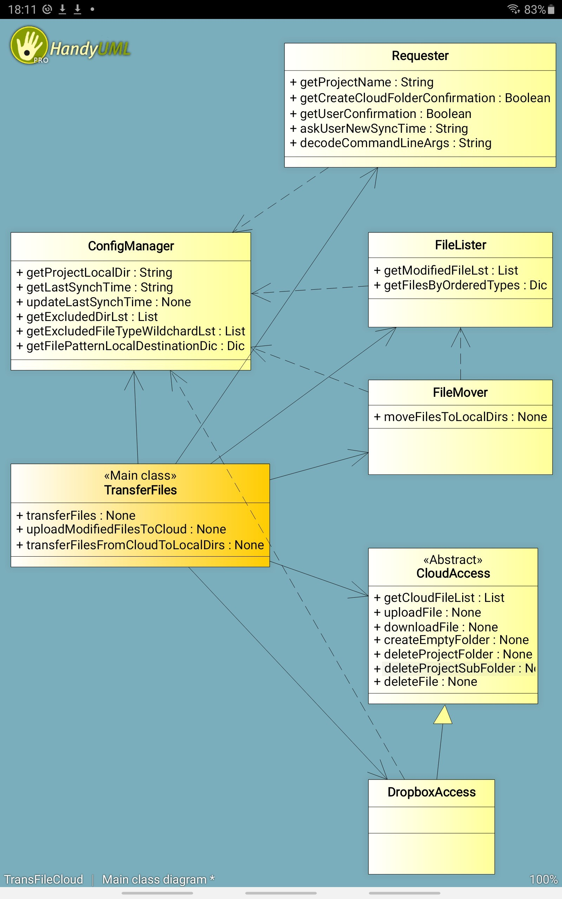

# Moving files to specific directories utility
The TransferFiles utility is used to transfer files from one device to 
another device using the cloud as intermediary location. What makes 
TransferFiles unique is that the directory structures on both source and
target devices can be different. A local configuration file (transfiles.ini)
stores the information required for the transfer to be done correctly.

The utility works on Android and on Windows. It is particularly useful if you 
code on your tablet or smartphone aswell as using an IDE on your Windows pc.

More generally, it can be used to transfer any type of files between your 
devices without having each time to care for the destination dir.

## Project class diagram

  

## Version history
- 1.1 Added handling command line arguments
- 1.0 Working and unit tested version